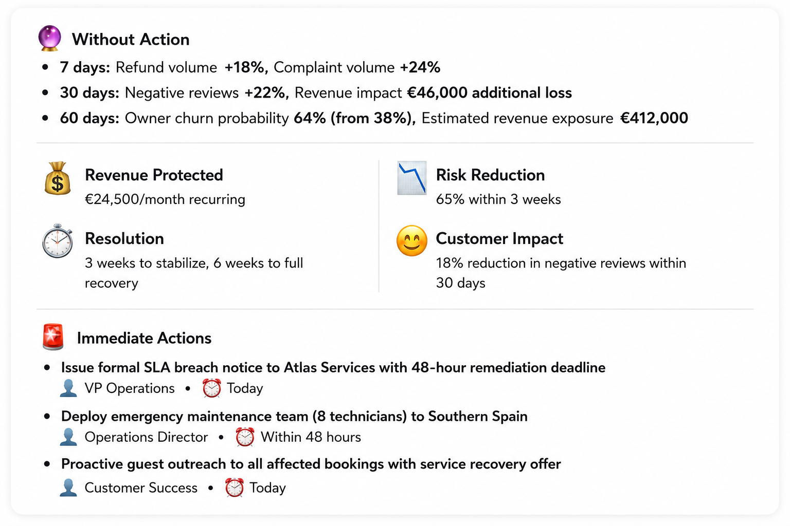
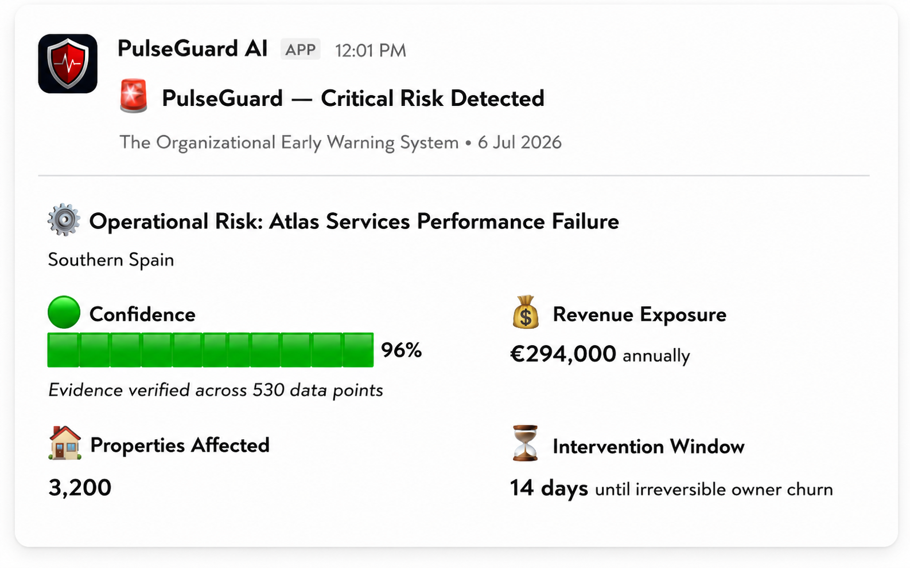
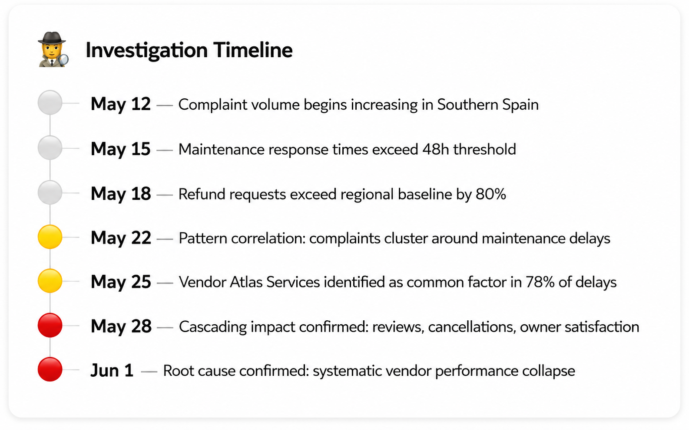
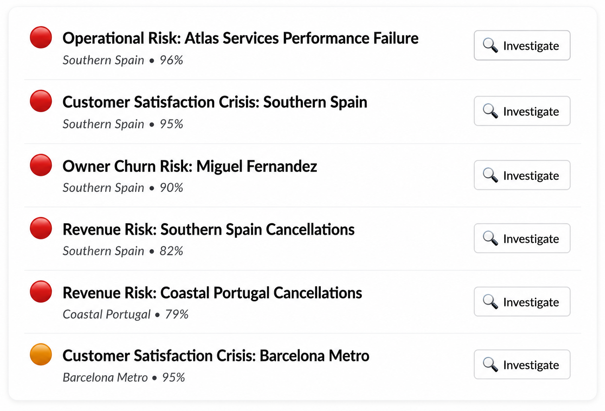
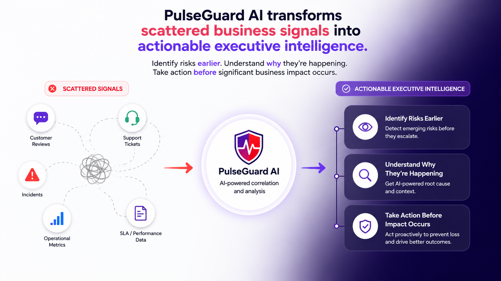

# PulseGuard AI

**An operational risk intelligence assistant that lives inside Slack.**

PulseGuard analyzes the operational data a team provides, correlates signals across it, and helps teams catch emerging risks earlier — surfacing likely root causes and recommended next steps directly in Slack, with a human always in the loop.

🔗 **Portfolio page:** [fusionwebapps.com/apps/pulseguard](https://www.fusionwebapps.com/apps/pulseguard)
🟢 **Install (public distribution):** `https://pulseguard-2j5l.vercel.app/slack/install`


---

## What it is

Most monitoring tools tell you a metric crossed a line you already knew to watch. PulseGuard is built for the harder problem: surfacing risks that are only visible when you connect signals scattered across different systems — a vendor's response times slipping, complaints clustering in one region, cancellations rising — before they compound into something bigger.

It runs entirely inside Slack. A team loads its operational data, and PulseGuard delivers prioritized risk briefs, root-cause investigations, and recommended actions as interactive Slack messages. It **recommends**; a person decides.

> **Note:** PulseGuard analyzes the data you provide and a built-in sample dataset. It does not currently connect to third-party tools (Zendesk, Salesforce, etc.) — those are roadmap items, described as such below.

---

## The problem it solves

Operational crises rarely appear out of nowhere. They build over weeks, leaving a trail of weak signals across separate systems. Each looks minor alone; no single person is watching all of them together. By the time the pattern is obvious, the damage is done.

PulseGuard correlates those signals programmatically and uses AI to make the connection legible — so teams can catch emerging risks earlier instead of reacting after the fact.

---

## How it works

```
Operational data (provided by the user)
        │
        ▼
Deterministic Risk Engine ── flags spikes, negative trends, threshold breaches,
        │                     and cross-signal correlations. No AI in scoring.
        ▼
   Detected risks (typed, severity-scored, with an evidence trail)
        │
        ▼
AI Investigation Layer ──── explains likely root cause, attaches a confidence
        │                   score and reasoning, recommends next steps
        ▼
Slack delivery ──────────── interactive briefs, reports, and investigations
        │
        ▼
Human-approved action ───── high-impact recommendations surface Approve / Reject
                            controls. The AI advises; the person decides.
```

A deliberate design choice underpins this: **AI is used for explanation and recommendation, never for the underlying risk scoring.** Detection is deterministic — statistical spike detection, trend analysis, threshold comparison, and correlation — which keeps results consistent, auditable, and free of hallucinated numbers. The LLM's job is to reason about *why* and suggest *what next*, grounded in the evidence the engine produces.

---

## Features

- **Deterministic risk detection** across four categories: customer satisfaction, revenue, operational, and partner/owner churn
- **AI investigation** with a tool-using agent that queries the underlying data to build an evidence-backed root-cause analysis
- **Human-in-the-loop approvals** — high-impact recommendations require explicit Approve/Reject confirmation
- **Bring-your-own data** — load operational data as JSON or CSV via a Slack modal; explore a built-in sample dataset until you do
- **MCP server** — exposes PulseGuard's risk intelligence to other MCP-compatible AI tools and agents
- **Per-workspace isolation** — each Slack workspace's data and tokens are stored separately
- **Usage & plan limits** — AI operations are metered per workspace against configurable plan tiers

### Slash commands

| Command | What it does |
|---|---|
| `/executive-summary` | Prioritized brief of all detected risks with severity and confidence |
| `/risk-report` | Every detected risk ranked by severity (lists risk IDs) |
| `/why-risk [risk-id]` | Root-cause analysis with the supporting evidence for one risk |
| `/recommend-action [risk-id]` | Recommended next steps, with Approve/Reject for high-impact actions |
| `/pulse` | Quick status check |
| `/pulseguard-load` | Load your own operational data (JSON or CSV) via a modal |
| `/pulseguard-data` | View what data is loaded, or reset to the sample |

### Plans

Configurable plan tiers meter AI usage per workspace:

| Plan | AI operations / month |
|---|---|
| Free | 10 |
| Pro | 200 |
| Business | 1,000 |

Limits are enforced **before** each AI call, so a workspace over its limit never incurs API cost. Plan values are configurable via environment variables. (Billing is architected Stripe-ready; payment processing is not wired up — it's a clean abstraction, not a live integration.)

---

## Architecture

PulseGuard is a Node.js application deployed as Vercel serverless functions, with a clean separation between deterministic logic, the AI layer, the Slack interface, and the MCP surface.

### Folder structure

```
api/
  slack.js              Vercel entry point — Slack events, OAuth install flow, /health
  mcp.js                Vercel entry point — MCP server (stateless HTTP transport)
src/
  app.js                Local dev entry point (Socket Mode / HTTP)
  engine/
    riskDetector.js     Deterministic risk detection (dataset-injectable)
    investigationAgent.js  Tool-using OpenAI agent for risk investigation
    aiNarrative.js      AI narrative generation (root cause, recommendations, summary)
    agentIntelligence.js   Deterministic display data (timelines, forecasts, evidence)
    cache.js            In-memory response cache + demo-mode flag
  services/
    dataStore.js        Per-workspace dataset persistence (Upstash Redis / in-memory)
    dataParser.js       CSV/JSON parsing + validation (no dependency; custom CSV parser)
    usageTracker.js     Per-workspace AI usage metering
    billingService.js   Plan/subscription abstraction (Stripe-ready)
    inputSanitiser.js   Prompt-injection defense + input size limits
    logger.js           Structured JSON logging (never logs secrets/tokens)
  slack/
    commands.js         Slash commands, buttons, modals, approval flow, data upload
    blocks.js           Block Kit UI builders
    installationStore.js  Per-workspace OAuth token storage (Upstash / in-memory)
  mcp/
    server.js           Local MCP server (Express, stateful sessions)
    tools.js            Shared MCP tool registry (validated with Zod)
  data/
    mockData.js         Built-in synthetic sample dataset
tests/                  180 tests (node:test) across engine, services, MCP, tenancy
docs/                   Security, AI cost control, distribution, case study
```

### Layers

**Slack app layer** — Built on `@slack/bolt`. Handles slash commands, interactive buttons, modals, the App Home tab, and the OAuth v2 install flow. Deployed as a Vercel serverless function (`api/slack.js`); a Socket Mode path (`src/app.js`) exists for local development. All requests are verified via Slack's HMAC request signing.

**Risk engine** (`src/engine/riskDetector.js`) — Pure, deterministic detection. Refactored to accept an injectable dataset so it can run against either a workspace's uploaded data or the sample dataset, with the two kept isolated. Produces typed risk objects with severity scores, confidence, and an evidence trail.

**AI / LLM layer** — Two OpenAI-backed components:
- `investigationAgent.js` — a tool-using agent (OpenAI function calling) that selects and calls data-query tools to build an evidence-backed investigation, capped at a fixed number of tool-call rounds.
- `aiNarrative.js` — generates the executive summary, root-cause narrative, and recommendations.

Both are billing-gated (usage checked before the call), token-capped, cached, and fall back gracefully when the API is unavailable. A `DEMO_MODE` flag bypasses OpenAI entirely for zero-dependency local runs.

**MCP server** — A Model Context Protocol server exposing PulseGuard's intelligence as tools (list risks, get a risk, investigate, calculate impact, get recommendations, forecast, etc.) to other AI agents. A shared tool registry (`src/mcp/tools.js`) is used by both the local Express server and the stateless Vercel serverless function, with every tool input validated via Zod.

**Data storage** — Per-workspace datasets and OAuth installations persist in Upstash Redis in production, with an in-memory fallback for local development. Storage is namespaced by workspace ID so one workspace can never read another's data or token.

**Security** — HMAC verification on every Slack request; OAuth state (CSRF) verification handled in the install flow; secrets kept in environment variables and never logged; prompt-injection sanitisation and input size limits on all AI inputs; per-tenant isolation. See [`docs/SECURITY.md`](docs/SECURITY.md).

### Data flow (a typical `/why-risk` call)

1. Slack sends the command to `api/slack.js`; Bolt verifies the request signature.
2. The workspace's dataset is loaded from `dataStore` (or the sample dataset as fallback).
3. `riskDetector` produces the current risk set; the requested risk is located.
4. The usage tracker checks the workspace is within its plan limit.
5. The AI layer investigates — sanitised inputs, token cap, cached where possible.
6. The result is rendered as Block Kit and returned to Slack; high-impact recommendations attach Approve/Reject controls.

---

## Tech stack

Detected from the repository:

- **Runtime:** Node.js 18+
- **Slack:** `@slack/bolt` (Slack Bolt SDK, OAuth v2, Block Kit)
- **AI:** `openai` (OpenAI API — GPT models, function calling)
- **MCP:** `@modelcontextprotocol/sdk`
- **Storage:** `@upstash/redis` (serverless Redis)
- **Validation:** `zod`
- **Config:** `dotenv`
- **Testing:** Node's built-in `node:test` (180 tests) — no external test framework
- **Deployment:** Vercel (serverless functions)

Notably, the CSV parser and the risk engine are hand-rolled rather than pulled from libraries, keeping the dependency surface small.

---

## How it was built

I build software as an AI-native developer — designing systems and shipping products end to end by working with AI coding agents (Claude Code, Kiro) rather than hand-writing every line. PulseGuard is a product of that workflow: I owned the architecture decisions, the product scope, the integrity constraints, and the debugging, and drove the implementation through AI agents.

That approach shows up in the engineering choices here — the deterministic-vs-AI separation, per-tenant isolation, prompt-injection defense, usage metering, and a 180-test suite — and in the discipline applied when the app went through Slack's Marketplace review: auditing the app so that every figure it reports is grounded in the user's real data, sample data is clearly labeled, and the app never claims to have taken an action it didn't. The role is closer to an engineer who directs and reviews than one who types every character — and the finished system reflects that end-to-end ownership.

---

## Screenshots

> Shown with the built-in sample dataset (a fictional vacation-rental company). PulseGuard labels sample data as such in-app; once you load your own data with `/pulseguard-load`, it analyzes that instead.

**Concept — scattered signals to executive intelligence**



**Critical risk alert in Slack**



**Risk report — all risks ranked by severity**



**Investigation timeline — how confidence built over time**



**Recommendation detail — forecast, impact, and next steps**



A walkthrough video is linked from the [portfolio page](https://www.fusionwebapps.com/apps/pulseguard).

---

## Status & roadmap

**Status:** Publicly installable via OAuth and fully functional. Went through Slack Marketplace review; a Marketplace listing additionally requires a minimum installed-workspace count, which is an adoption threshold rather than a technical one.

**Roadmap:**
- Live data connectors (Zendesk, Salesforce, HubSpot, etc.) — currently users bring their own data; connectors are future work
- Larger-scale data ingestion beyond the paste-modal size limit
- Historical tracking of risk scores across uploads (current analysis is point-in-time)
- Stripe payment processing on top of the existing billing abstraction
- Broader, industry-agnostic data schema (current model is oriented toward property-management/hospitality-style operations)

---

## Testing

```bash
npm test          # runs the full node:test suite (180 tests)
```

Coverage spans the risk engine, data parsing/validation, per-workspace storage and isolation, usage metering, billing logic, MCP tool validation, and prompt-injection sanitisation.
